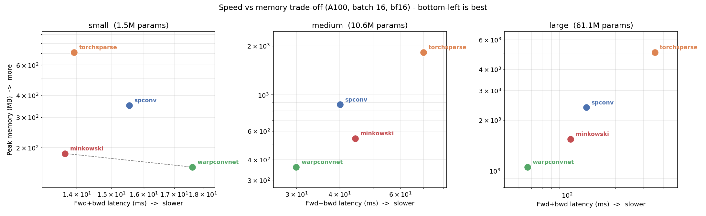
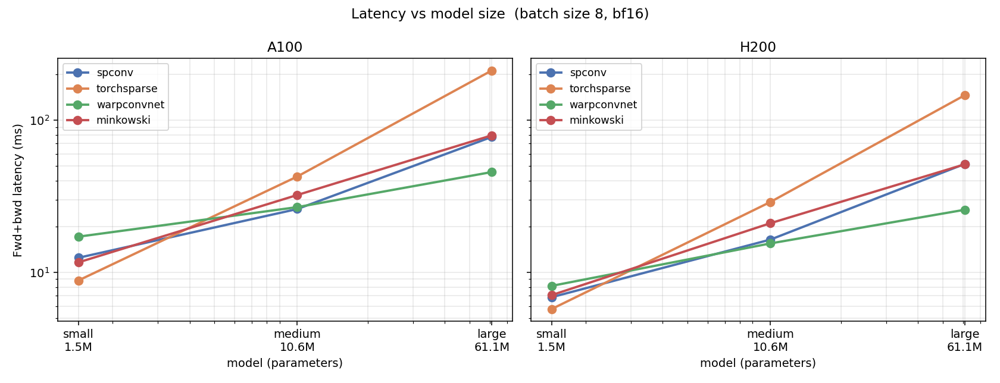
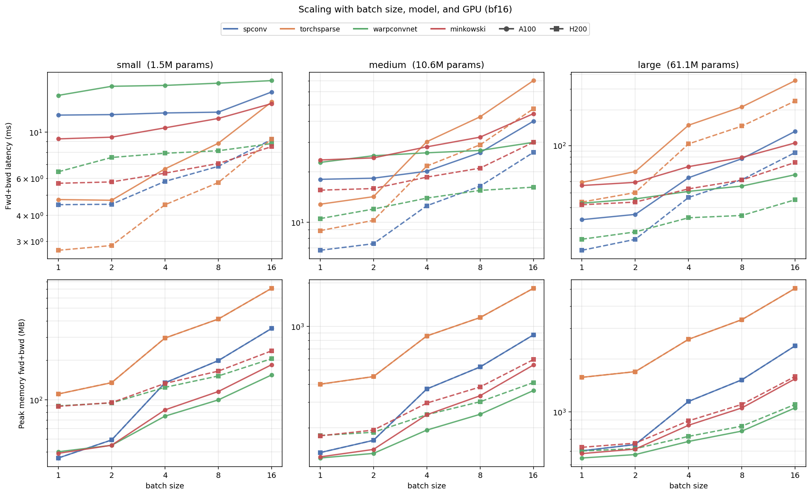
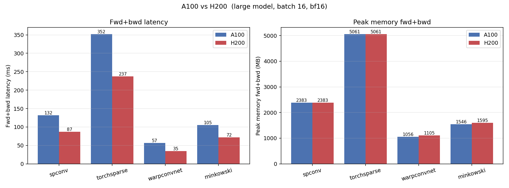

# Sparse Convolution Library Benchmark (PILArNet-M)

Speed (forward and forward+backward latency) and GPU memory (peak allocated / reserved) for four 3D **sparse-convolution** libraries on the PILArNet-M dataset, on **A100** and **H200**, in bf16.

## Libraries

| Library | Version | torch / CUDA | Sparse-conv kernels |
| --- | --- | --- | --- |
| [spconv](https://github.com/traveller59/spconv) | `spconv-cu124` 2.3.8 | 2.5.0 / 12.4 | implicit GEMM / native |
| [torchsparse++](https://github.com/mit-han-lab/torchsparse) | master `385f5ce` | 2.5.0 / 12.4 | adaptive gather-scatter / implicit GEMM |
| [WarpConvNet](https://github.com/NVlabs/WarpConvNet) | `fix/cute-grouped-sm90-cpasync-race` (`a798838`) | 2.5.0 / 12.4 runtime, built with 12.8 | Warp + CUTLASS implicit / CuTe grouped GEMM |
| [MinkowskiEngine](https://github.com/NVIDIA/MinkowskiEngine) | 0.5.4 (DeepLearnPhysics `larcv` container) | 2.5.1 / 12.1 | gather-scatter / coordinate hashing |

## Setup

- **GPUs:** A100-SXM4-40GB (SM 8.0) and H200 NVL (SM 9.0, 143 GB); SLURM account `neutrino:ml-dev`, partitions `ampere` / `hopper`.
- **Precision:** bf16 via `torch.autocast`. Configurable: `--precision {fp32,tf32,bf16,fp16}`.
- **Data:** [PILArNet-M-mini](https://huggingface.co/datasets/DeepLearnPhysics/PILArNet-M-mini) via HuggingFace `datasets`, voxel size 1 (~600-12000 active voxels / event, native 768³ grid); input feature = energy deposition.
- **Network:** identical ResNet-style 3D sparse encoder (submanifold stem + 4 strided stages) built for each library from one [`NetworkSpec`](src/spconv_bench/networks/spec.py). small / medium / large = **1.5M / 10.6M / 61.1M** params.
- **Measurement:** median of 30 CUDA-event-timed iterations after 20 warmup, steady state (input built once); byte-identical inputs across libraries.

## Results - A100 (bf16)


**Forward+backward latency** (median ms) - full tables in [`results/summary.md`](results/summary.md):

| model / batch | spconv | torchsparse | warpconvnet | minkowski |
| --- | ---: | ---: | ---: | ---: |
| small,  bs=1  | 12.1 | **4.8** | 15.0 | 9.3 |
| small,  bs=16 | 15.5 | 13.9 | 17.6 | **13.7** |
| medium, bs=1  | 18.0 | **12.8** | 22.7 | 23.5 |
| medium, bs=16 | 40.1 | 70.0 | **29.9** | 44.4 |
| large,  bs=1  | 23.8 | 49.0 | 32.7 | 46.1 |
| large,  bs=8  | 77.5 | 211.6 | **45.5** | 79.3 |
| large,  bs=16 | 131.8 | 352.2 | **56.8** | 105.2 |

**Peak memory, forward+backward** (MB allocated):

| model / batch | spconv | torchsparse | warpconvnet | minkowski |
| --- | ---: | ---: | ---: | ---: |
| small,  bs=16 | 351 | 711 | **155** | 185 |
| medium, bs=16 | 873 | 1828 | **361** | 541 |
| large,  bs=8  | 1525 | 3356 | **778** | 1055 |
| large,  bs=16 | 2383 | 5061 | **1056** | 1546 |

**fp32 vs bf16** (large, bs=16, fwd+bwd ms):

| | spconv | torchsparse | warpconvnet | minkowski |
| --- | ---: | ---: | ---: | ---: |
| fp32 | 1008 | 352 | 66 | 111 |
| bf16 | **132** | 352 | **57** | 105 |

Notes: WarpConvNet uses `order=POINT_ORDERING.MORTON_XYZ`; spconv sets `SPCONV_ALLOW_TF32`; torchsparse and MinkowskiEngine do not respond to `torch.autocast` (their bf16 == fp32).

## Speed vs memory trade-off



## Scaling (model size, batch size, GPU)





Per-GPU bar / scaling / speedup plots: [`results/plots/`](results/plots) (A100), [`results/h200/plots/`](results/h200/plots) (H200).

## Results - H200 (Hopper)



**A100 -> H200** (large, bs=16, fwd+bwd ms) - full tables in [`results/h200/summary.md`](results/h200/summary.md):

| library (bs=16) | A100 | H200 | speedup |
| --- | ---: | ---: | ---: |
| warpconvnet | 57 | **35** | 1.6x |
| spconv | 132 | 87 | 1.5x |
| torchsparse | 352 | 237 | 1.5x |
| MinkowskiEngine | 105 | 72 | 1.5x |

Notes: torchsparse and WarpConvNet were rebuilt for sm_90 (`TORCH_CUDA_ARCH_LIST="8.0 9.0"`); WarpConvNet uses the `fix/cute-grouped-sm90-cpasync-race` branch (`a798838`) built with CUDA 12.8, whose CuTe grouped-GEMM Hopper kernels (`cute_grouped_sm90`, `use_cp_async`) are auto-selected and correct on H200 (release 1.7.11's Hopper kernels fail to compile on CUDA 12.4 and produce NaN on 12.8). WarpConvNet stays fastest on H200 (35 ms, 1.6x over A100).

## Reproduce

```bash
bash scripts/setup_env.sh                            # build the environment (once)

# A100 -> results/
sbatch scripts/submit_ampere.sbatch

# H200 -> results/h200/
sbatch --partition=hopper --account=neutrino:ml-dev --gres=gpu:h200:1 \
       --export=ALL,OUTDIR=results/h200 scripts/submit_ampere.sbatch

# aggregate + cross-cutting plots
python -m spconv_bench.report  results/*.json      --outdir results
python -m spconv_bench.compare --a100 results --h200 results/h200 --outdir results/comparison
```

The sbatch honours `OUTDIR`, `PRECISION`, `SPECS`, `BATCHES` env vars.

## Repository layout

```
src/spconv_bench/
  data.py                # PILArNet-M loading (datasets) + voxelization + cache
  bench.py               # library-agnostic timing/memory harness + Adapter API + precision
  cli.py                 # run one library, dump results/<library>.json
  report.py              # aggregate JSON -> summary.md + CSV + per-device plots
  compare.py             # cross-cutting plots: vs model size, speed/memory Pareto, A100 vs H200
  networks/
    spec.py              # library-agnostic NetworkSpec (small/medium/large)
    {spconv,torchsparse,warpconvnet,minkowski}_net.py   # per-library model + adapter
scripts/
  setup_env.sh           # build the environment (+ sm_90 / H200 notes)
  submit_ampere.sbatch   # run all libraries on one GPU + aggregate (OUTDIR-parameterized)
  cuda_build_env.sh      # CUDA build-toolchain environment variables
```
