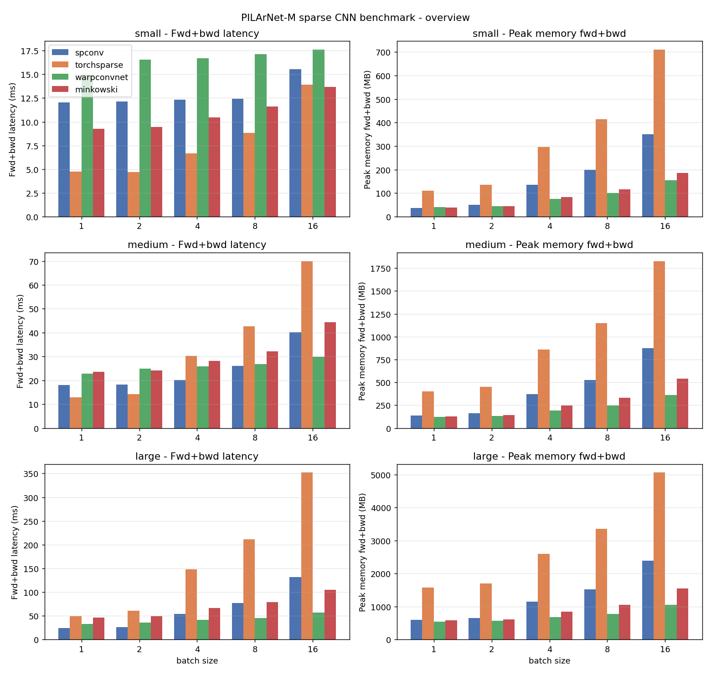
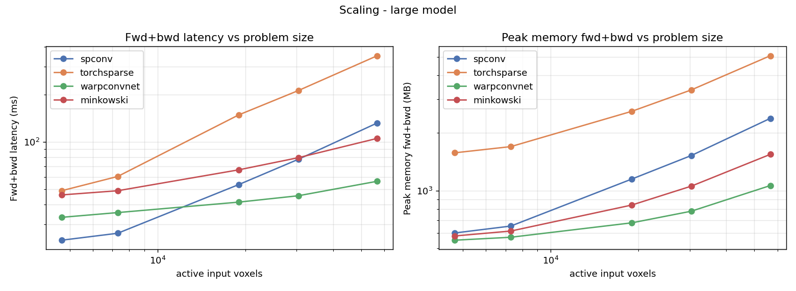

# Sparse Convolution Library Benchmark (PILArNet-M)

A detailed, apples-to-apples benchmark of 3D **sparse convolution** libraries on real liquid-argon TPC data.
It measures both **speed** (forward and forward+backward latency) and **GPU memory** (peak allocated and reserved) for an identical network architecture and identical inputs across each library, on both **A100** and **H200** GPUs.

## Libraries compared

| Library | Version | Env (torch / CUDA) | Install | Sparse conv kernels |
| --- | --- | --- | --- | --- |
| [spconv](https://github.com/traveller59/spconv) | `spconv-cu124` 2.3.8 | 2.5.0 / 12.4 | prebuilt wheel | implicit GEMM / native |
| [torchsparse++](https://github.com/mit-han-lab/torchsparse) | master (`385f5ce`) | 2.5.0 / 12.4 | compiled from source | adaptive gather-scatter / implicit GEMM |
| [WarpConvNet](https://github.com/NVlabs/WarpConvNet) | 1.7.11 | 2.5.0 / 12.4 | compiled from source (CUTLASS) | NVIDIA Warp + CUTLASS implicit GEMM |
| [MinkowskiEngine](https://github.com/NVIDIA/MinkowskiEngine) | 0.5.4 | 2.5.1 / 12.1 | prebuilt in DeepLearnPhysics container | gather-scatter / coordinate hashing |

MinkowskiEngine's last release (0.5.4, 2021) has no CUDA-12 / torch-2.x wheel and no clean modern source build, so rather than compile it we run it from the **DeepLearnPhysics `larcv` container** (`/sdf/group/neutrino/images/develop.sif`), which ships ME 0.5.4 built against **torch 2.5.1 + CUDA 12.1** - the same modern stack as the other three libraries. This keeps the comparison apples-to-apples (all four on torch 2.5.x / CUDA 12.x).
WarpConvNet, from the same author (Chris Choy) and now maintained at NVIDIA, is its modern successor.

## What is measured

For every `(library, network size, batch size)` configuration:

- **Forward latency** - training-mode forward pass, timed under `no_grad`.
- **Forward+backward latency** - forward, `loss = output.sum()`, `loss.backward()`.
- **Peak memory (forward)** and **peak memory (forward+backward)** - `torch.cuda.max_memory_allocated` / `max_memory_reserved`.
- **Throughput** - active input voxels processed per second (forward+backward).

Timing uses CUDA events with warmup iterations and `torch.cuda.synchronize`; each result reports mean/median/std/min/p90 over the timed iterations.

## Fairness methodology

- **Identical architecture.** Every library builds the same ResNet-style 3D sparse encoder from one library-agnostic [`NetworkSpec`](src/spconv_bench/networks/spec.py): a submanifold stem, then stages of `[strided sparse conv downsample] + N submanifold residual blocks`, with channels doubling per stage. Three sizes (`small`/`medium`/`large`) probe how each library scales with width and depth.
- **Identical inputs.** All libraries consume byte-identical voxelized events, cached to disk once (see below).
- **Rulebook cost included.** The library sparse tensor is rebuilt from pre-uploaded GPU coordinates *inside every timed iteration*, so the cost of building the convolution rulebook / kernel map is counted (this is what a training loop over varying data actually pays), while host-to-device transfer is not re-timed.
- **Matched software stack.** spconv, torchsparse++ and WarpConvNet run in one environment on torch 2.5.0 / CUDA 12.4; MinkowskiEngine runs in the DeepLearnPhysics container on torch 2.5.1 / CUDA 12.1. All four are therefore on torch 2.5.x / CUDA 12.x, so measured differences reflect the libraries, not their dependencies.

## Dataset

[PILArNet-M-mini](https://huggingface.co/datasets/DeepLearnPhysics/PILArNet-M-mini) is loaded with the HuggingFace `datasets` library.
Each event's `point` array is reshaped to `(N, 8)`: columns 0-2 are integer voxel coordinates on a 768³ grid, columns 3-7 are per-voxel features (energy and count-like quantities).
Events are voxelized at **voxel size 1** (the native resolution, so one point per voxel) and cached as a compact ragged array.
The input feature is the energy deposition (`in_channels=1` by default); active voxels per event range from ~600 to ~12000, and batching scales this up.

## Environment

spconv, torchsparse++ and WarpConvNet have conflicting build requirements but all work against one modern CUDA 12.4 / torch 2.5 stack once compiled, so the benchmark uses a **single environment** for those three.
MinkowskiEngine 0.5.4 predates that stack, so it runs from the DeepLearnPhysics `larcv` container (torch 2.5.1 + CUDA 12.1; see step 8 of `scripts/setup_env.sh` and the `apptainer exec` call in `scripts/submit_ampere.sbatch`).
It is built as a clone of the existing `pimm` conda env (which already provides torch 2.5.0+cu124, a coherent CUDA 12.4 toolchain with `nvcc`, and `spconv-cu124`), plus the CUDA dev headers needed to compile extensions.
`uv` is used as the package installer and to compile torchsparse++ and WarpConvNet; cloning leaves the original `pimm` env untouched.
See [`scripts/setup_env.sh`](scripts/setup_env.sh) for the exact, reproducible steps.

The GPU is an **NVIDIA A100-SXM4-40GB** (SM 8.0) on the SLURM `ampere` partition (account `neutrino:ml-dev`).

## Repository layout

```
src/spconv_bench/
  data.py                  # PILArNet-M loading (datasets) + voxelization + cache
  bench.py                 # library-agnostic timing/memory harness + Adapter API
  cli.py                   # run one library, dump results/<library>.json
  report.py                # aggregate JSON -> summary.md + CSV + plots
  networks/
    spec.py                # library-agnostic NetworkSpec (small/medium/large)
    spconv_net.py          # spconv model + adapter
    torchsparse_net.py     # torchsparse++ model + adapter
    warpconvnet_net.py     # WarpConvNet model + adapter
    minkowski_net.py       # MinkowskiEngine model + adapter
scripts/
  setup_env.sh             # build the benchmark environment
  submit_ampere.sbatch     # run all libraries on one A100 + aggregate
  cuda_build_env.sh        # CUDA build-toolchain environment variables
```

## Usage

```bash
# 1. Build the environment (clone pimm + compile torchsparse/warpconvnet)
bash scripts/setup_env.sh

# 2. Run the full benchmark on an A100 and aggregate
sbatch scripts/submit_ampere.sbatch

# ...or run one library interactively on a GPU node
python -m spconv_bench.cli --library spconv --split val --voxel-size 1 \
    --specs small medium large --batch-sizes 1 4 8 --out results/spconv.json

# 3. Aggregate into tables + plots
python -m spconv_bench.report results/*.json --outdir results
```

## Results

Measured on one **NVIDIA A100-SXM4-40GB** (SM 8.0), in **bf16 mixed precision** (`torch.autocast`, the modern training default), all four libraries on **torch 2.5.x / CUDA 12.x** (spconv/torchsparse/WarpConvNet: 2.5.0+cu124; MinkowskiEngine: 2.5.1+cu121 via the container).
Inputs are the 20 PILArNet-M-mini validation events voxelized at voxel size 1 (~600-12000 active voxels each); batches are the first `B` events.
Every number is the median over 30 timed iterations after 20 warmup iterations.
Full tables are in [`results/summary.md`](results/summary.md); raw per-configuration data is in [`results/results.csv`](results/results.csv). Other precisions are one flag away (`--precision {fp32,tf32,bf16,fp16}`).



### Headline (bf16)

- **WarpConvNet is the standout at scale** - fastest on the medium and large models (**56 ms** vs spconv 132, torchsparse 352 at large / bs=16) **and** the most memory-efficient (down to **0.21x** torchsparse's peak memory). It needs one non-default setting - a deterministic point ordering - to reach this; see below.
- **MinkowskiEngine** is a strong all-rounder - second-fastest at large scale (105 ms) and low memory - now on the same torch 2.5.1 as the others.
- **spconv** benefits the most from bf16 (large/bs=16: **1008 ms fp32 -> 132 ms bf16**); together with WarpConvNet it is one of the two libraries that actually leverage `torch.autocast`.
- **torchsparse++ is fastest at small scale** but **does not respond to `torch.autocast`** - its bf16 numbers equal its fp32 - so under mixed precision it becomes the slowest and most memory-hungry at large scale.

### Forward+backward latency (median ms, bf16, lower is better)

| network / batch | spconv | torchsparse | warpconvnet | minkowski |
| --- | ---: | ---: | ---: | ---: |
| small,  bs=1  | 12.1 | **4.8** | 15.0 | 9.3 |
| small,  bs=16 | 15.5 | 13.9 | 18.1 | **13.7** |
| medium, bs=1  | 18.0 | **12.8** | 23.1 | 23.5 |
| medium, bs=16 | 40.1 | 70.0 | **29.0** | 44.4 |
| large,  bs=1  | 23.8 | 49.0 | 33.2 | 46.1 |
| large,  bs=8  | 77.5 | 211.6 | **45.5** | 79.3 |
| large,  bs=16 | 131.8 | 352.2 | **56.2** | 105.2 |

### Peak memory, forward+backward (MB allocated, bf16, lower is better)

| network / batch | spconv | torchsparse | warpconvnet | minkowski |
| --- | ---: | ---: | ---: | ---: |
| small,  bs=16 | 351 | 711 | **148** | 185 |
| medium, bs=16 | 873 | 1828 | **366** | 541 |
| large,  bs=8  | 1525 | 3356 | **780** | 1055 |
| large,  bs=16 | 2383 | 5061 | **1062** | 1546 |

### Precision matters a lot - and unevenly

Two things surprised us and are worth knowing:

1. **TF32 alone does nothing here.** These libraries run their own CUDA GEMMs, not torch's fp32 matmul, so `torch.set_float32_matmul_precision("high")` has no effect. spconv even has its *own* switch, `spconv.constants.SPCONV_ALLOW_TF32` (the harness sets it) - without it, spconv's fp32 is ~8x slower than it should be.
2. **Only spconv and WarpConvNet leverage `torch.autocast`.** torchsparse and MinkowskiEngine ignore it (their bf16 results, and memory, are identical to fp32); they would need explicit half-precision input casting to benefit.

Effect of bf16 on the large model at batch 16 (fwd+bwd, ms):

| | spconv | torchsparse | warpconvnet | minkowski |
| --- | ---: | ---: | ---: | ---: |
| fp32 | 1008 | 352 | 66 | 111 |
| **bf16** | **132** (7.6x) | 352 (1.0x) | **56** | 105 |

Per-network bar charts, log-log scaling curves, and speedup-vs-spconv plots are in [`results/plots/`](results/plots).



### WarpConvNet needs a deterministic point ordering

WarpConvNet's strided convolution emits its downsampled coordinates in `POINT_ORDERING.RANDOM` **by default**.
Because the benchmark reuses the input each iteration, that means each pooled-resolution geometry is laid out differently on every forward pass, so WarpConvNet's per-geometry kernel-map cache never hits and its neighbour search is spatially incoherent.
With the default ordering, batched latency was inflated by roughly **10x** and never reached steady state (e.g. small / bs=16 sat at a flat ~250 ms of pure overhead - see the git history of this file).

Setting a deterministic space-filling (Morton) order on the strided convolutions - `order=POINT_ORDERING.MORTON_XYZ`, done in [`warpconvnet_net.py`](src/spconv_bench/networks/warpconvnet_net.py) - makes the downsampled coordinates reproducible and locality-friendly.
The kernel map is then built once during warmup and reused, and latency drops to the numbers above (small / bs=16: 250 ms → 19 ms).
This is the single most important knob for WarpConvNet performance, and worth knowing for anyone deploying it.
spconv, torchsparse and MinkowskiEngine thread one kernel-map cache through the whole network, so they do not need it.

## Results on H200 (Hopper)

The same benchmark on an **NVIDIA H200 NVL** (Hopper, SM 9.0, 143 GB, driver 575), bf16, on the `hopper` partition.
Full tables are in [`results/h200/summary.md`](results/h200/summary.md); plots in [`results/h200/plots/`](results/h200/plots).

Getting there needed a rebuild: the compiled libraries were built for sm_80, so torchsparse and WarpConvNet were recompiled for sm_90 (`TORCH_CUDA_ARCH_LIST="8.0 9.0"`); spconv's wheel and the container's MinkowskiEngine already ship sm_90.
WarpConvNet's Hopper (CuTe/CUTLASS) kernels additionally need **CUDA 12.8** to compile - 12.4's ptxas rejects them (`State space incorrect for instruction`).

### A100 -> H200 speedup (large model, bf16, fwd+bwd, ms)

| library (bs=16) | A100 | H200 | speedup |
| --- | ---: | ---: | ---: |
| spconv | 132 | 87 | 1.5x |
| torchsparse | 352 | 237 | 1.5x |
| MinkowskiEngine | 105 | 72 | 1.5x |

H200 is a consistent **~1.5x faster** than A100 across the three libraries that run cleanly, in line with its higher SM count and HBM3e bandwidth.

### WarpConvNet is broken on Hopper (in 1.7.11)

WarpConvNet's fast auto-tuned CuTe/CUTLASS Hopper kernels produce **NaN** for many shapes (medium/large models at small batch), in **both fp32 and bf16** - the auto-tuner scores candidates on speed, not correctness, and selects a numerically wrong kernel.
The only correct configuration we found is to pin a non-CuTe algorithm (`WARPCONVNET_*_ALGO_MODE=explicit_gemm`), which runs but is 3-5x slower than WarpConvNet's A100 speed.
The H200 WarpConvNet numbers therefore reflect that slow-but-correct fallback, **not** the hardware - a limitation of WarpConvNet 1.7.11 on Hopper, not of the H200.

### Reproduce

```bash
bash scripts/setup_env.sh                 # build the environment (once)

# A100 (ampere partition) -> results/
sbatch scripts/submit_ampere.sbatch

# H200 (hopper partition) -> results/h200/
sbatch --partition=hopper --account=neutrino:ml-dev --gres=gpu:h200:1 \
       --export=ALL,OUTDIR=results/h200 scripts/submit_ampere.sbatch
```

The sbatch honours `OUTDIR`, `PRECISION` (`fp32|tf32|bf16|fp16`), `SPECS` and `BATCHES` env vars.
For H200, torchsparse/WarpConvNet must first be rebuilt for sm_90 (see `scripts/setup_env.sh`), and WarpConvNet needs `WARPCONVNET_*_ALGO_MODE=explicit_gemm` for correct results.
